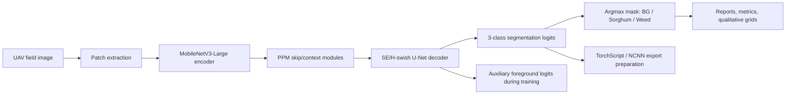
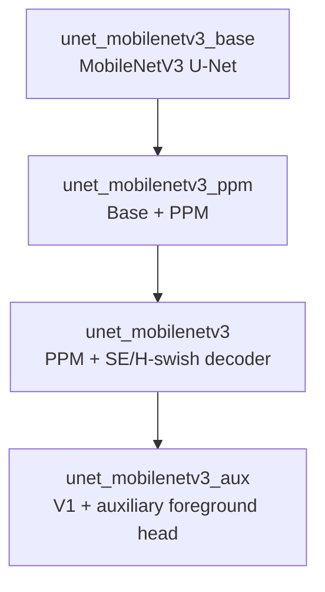

# UAV Weed Segmentation with MobileNetV3 U-Net


Semantic segmentation workflow for UAV field images. The model assigns every pixel to one of three classes:

| Class id | Label | Meaning |
| --- | --- | --- |
| `0` | Background | Soil, shadows, and non-plant pixels. |
| `1` | Sorghum | Crop pixels. |
| `2` | Weed | Weed pixels. |

Author: **I Gede Bagus Jayendra**  
License: **GNU General Public License v3.0**

This repository is written for research work, not for broad deployment claims. It contains training, prediction, comparison, evaluation, and edge-export preparation code for a UAV weed/crop segmentation experiment.


The figure above shows the usual report layout: image patch, ground truth mask, model prediction, and difference map. The color difference map helps locate where the predicted class disagrees with the annotation.

## Visual Examples

These images come from the existing README assets in `readme_fig/`. They are kept here as compact visual context for readers who are not familiar with semantic segmentation.

| Dataset / capture context | Confusion matrix | Prediction example |
| --- | --- | --- |
|  |  |  |

Reading the prediction example:

| Row | Meaning |
| --- | --- |
| Image Patch | UAV RGB crop from the field. |
| Ground Truth | Human annotation used as the reference mask. |
| Prediction | Model output after class-wise argmax. |
| Difference | Pixels where prediction and ground truth disagree. |

## Short Version

The current proposed model is:

```text
architecture = unet_mobilenetv3_aux
encoder      = mobilenetv3_large
checkpoint   = models/unet_mobilenetv3_aux_mobilenetv3_large_dil0_bilin1_pre1.pth.tar
```

In plain terms, it is a **MobileNetV3-Large U-Net** with:

| Component | Role |
| --- | --- |
| MobileNetV3-Large encoder | Extract compact multi-scale image features. |
| PPM skip/context modules | Add context at several pooling scales before decoder fusion. |
| SE/H-swish decoder blocks | Rebuild dense pixel masks while reweighting channels. |
| 3-class segmentation head | Predict Background, Sorghum, and Weed. |
| Auxiliary foreground head | During training, help the model separate Background from Vegetation. |

The auxiliary foreground head is used as extra supervision during training. The final runtime output is still the 3-class segmentation logits. Inference should decode the final mask with `argmax`, not sigmoid thresholding.

```text
class_mask = argmax(segmentation_logits, channel_dimension)
```

## What This Repo Compares

The main research comparison is between ResNet-backed baseline segmentation models and the proposed MobileNetV3-based model.

Baseline matrix:

```text
architectures = fcn8s, fcn16s, fcn32s, unet, dlplus
encoders      = resnet18, resnet34, resnet50, resnet101
```

Current final-candidate comparison target:

```text
fcn8s_resnet50
fcn16s_resnet50
fcn32s_resnet50
unet_resnet50
dlplus_resnet50
unet_mobilenetv3_aux
```

The ResNet-50 baseline artifacts were intentionally cleaned on 2026-07-10 for fair retraining. Do not cite a current ResNet-50 comparison until the baseline checkpoints, predictions, and reports have been regenerated.

## Visual Workflow



Model family summary:



## Current Status

| Area | Current state | Evidence boundary |
| --- | --- | --- |
| Proposed v2 model | Implemented and checkpoint path is defined. | Claim trained only when `models/unet_mobilenetv3_aux_mobilenetv3_large_dil0_bilin1_pre1.pth.tar` exists. |
| Main comparison | Five ResNet-50 baselines plus proposed v2. | Baselines must be regenerated after the cleanup before current comparison claims are made. |
| Edge export | TorchScript and NCNN export tooling exist. | Do not claim Raspberry Pi 5 runtime performance until measured on the Pi. |
| Webcam/local inference | OpenCV checker exists for image, video, or webcam input. | Claim a run only when a manifest exists under `results/webcam_inference_checks/<run_name>/manifest.json`. |
| Reports | Evaluation pipeline writes CSV, JSON, Markdown, confusion matrix, and qualitative grids. | Cite exact report files, subset, checkpoint, and metric table. |

Recommended local status files:

```text
docs/DEVELOPMENT_TRACKER.md
docs/COMPARISON_STATUS_V2.md
docs/COMPARISON_STATUS_V2_BBCH.md
exports/ncnn/unet_mobilenetv3_aux_256/export_manifest.json
```

## Tech Stack

| Tool | Used for |
| --- | --- |
| Python 3.13 | Main runtime on the local Windows machine. |
| PyTorch / TorchVision | Model implementation, training, checkpoint loading, TorchScript export. |
| CUDA on NVIDIA RTX 5060 8 GB | Local GPU training and inference. |
| Albumentations | Image augmentation and preprocessing. |
| OpenCV | Local image, video, and webcam inference checks. |
| Optuna | K-fold experiment trial management. |
| Pandas / NumPy / Matplotlib | Reports, metrics, tables, and figures. |
| NCNN / pnnx | Edge-export preparation for Raspberry Pi 5 work. |
| PowerShell | Windows run wrappers for repeatable experiment commands. |

Local runtime target:

```text
Python launcher: py
Python target:   3.13.12
Venv path:       .venv/
GPU target:      NVIDIA RTX 5060 8 GB
Main Python:     .\.venv\Scripts\python.exe
```

## Model Fundamentals

The model receives an RGB image patch and produces one logit channel per semantic class:

$$
z \in \mathbb{R}^{C \times H \times W}, \qquad C = 3
$$

Softmax converts logits into per-class probabilities:

$$
p_{i,c} =
\frac{\exp(z_{i,c})}
{\sum_{k=1}^{C}\exp(z_{i,k})}
$$

where `i` is a pixel index and `c` is a class index.

The final class for each pixel is:

$$
\hat{y}_i = \arg\max_{c} p_{i,c}
$$

For proposed v2, the auxiliary foreground target is:

$$
y_i^{fg} =
\begin{cases}
0, & y_i = 0 \\
1, & y_i > 0
\end{cases}
$$

So Background remains class `0`, while Sorghum and Weed are grouped as foreground only for the auxiliary branch.

## Training Objective

The proposed v2 training loss combines 3-class segmentation supervision and foreground/background auxiliary supervision:

$$
\mathcal{L}_{total}
=
\lambda_{ce}\mathcal{L}_{CE}
+
\lambda_{dice}\mathcal{L}_{Dice}
+
\lambda_{fg}\mathcal{L}_{FG}
$$

Cross-entropy for the 3-class segmentation head:

$$
\mathcal{L}_{CE}
=
-\frac{1}{N}\sum_{i=1}^{N}\log p_{i,y_i}
$$

Multi-class soft Dice loss:

$$
\mathcal{L}_{Dice}
=
1
-
\frac{1}{C}
\sum_{c=1}^{C}
\frac{2\sum_i p_{i,c}g_{i,c}+\epsilon}
{\sum_i p_{i,c}+\sum_i g_{i,c}+\epsilon}
$$

Auxiliary foreground loss:

$$
\mathcal{L}_{FG}
=
-\frac{1}{N}\sum_{i=1}^{N}\log q_{i,y_i^{fg}}
$$

Current proposed-v2 recipe:

```text
ce_weight = 1.0
dice_weight = 1.0
foreground_aux_weight = 0.3
validation objective = foreground_macro_f1
```

The foreground head is a training aid. It is not the final Sorghum-vs-Weed classifier.

## Evaluation Metrics

Metrics are computed from saved prediction masks and ground-truth masks. For class `c`:

$$
IoU_c =
\frac{TP_c}
{TP_c + FP_c + FN_c}
$$

$$
Dice_c =
\frac{2TP_c}
{2TP_c + FP_c + FN_c}
$$

$$
Precision_c =
\frac{TP_c}
{TP_c + FP_c}
$$

$$
Recall_c =
\frac{TP_c}
{TP_c + FN_c}
$$

$$
F1_c =
\frac{2 \cdot Precision_c \cdot Recall_c}
{Precision_c + Recall_c}
$$

Mean IoU and mean Dice:

$$
mIoU =
\frac{1}{C}
\sum_{c=1}^{C} IoU_c
$$

$$
MeanDice =
\frac{1}{C}
\sum_{c=1}^{C} Dice_c
$$

Pixel accuracy:

$$
PixelAccuracy =
\frac{\sum_c TP_c}
{TotalPixels}
$$

Efficiency reports use a `480x480` RGB input unless the command overrides the benchmark input size.

## Repository Layout

| Path | Purpose |
| --- | --- |
| `train.py` | Optuna k-fold training entrypoint. |
| `save_patches.py` | Converts raw images/masks into patch folders for training. |
| `predict_testset.py` | Runs inference for one checkpoint and writes a per-model report. |
| `compare_model_predictions.py` | Compares saved prediction folders against the same ground truth. |
| `evaluate_model_suite.py` | Builds segmentation, efficiency, qualitative, CSV, JSON, and Markdown summaries. |
| `scripts/run_proposed_model.ps1` | Windows wrapper for proposed v1/v2 runs. |
| `scripts/run_resnet50_architecture_comparison.ps1` | Current ResNet-50 six-model comparison wrapper. |
| `scripts/run_model_suite.py` | Shared Python suite runner used by wrapper scripts. |
| `scripts/export_proposed_ncnn.py` | Exports proposed v2 through a segmentation-only wrapper. |
| `scripts/check_webcam_inference.py` | Local OpenCV checker for image, video, or webcam input. |
| `utils/manual_unet_mobilenetv3.py` | Proposed MobileNetV3 U-Net, PPM, SE decoder, and auxiliary foreground head. |
| `utils/model_registry.py` | Central model matrix, checkpoint paths, prediction paths, and report paths. |
| `utils/labels.py` | Shared class names and colors. |
| `utils/segmentation_metrics.py` | Pixel accuracy, IoU, Dice, precision, recall, F1, and confusion matrix logic. |
| `utils/efficiency.py` | Params, model size, GFLOPs, FPS, latency, and memory benchmark logic. |

## Documentation Map

| File | Use it for |
| --- | --- |
| `AGENTS.md` | Rules for future AI agents, evidence boundaries, and protected artifacts. |
| `docs/TRAINING_WINDOWS_RTX5060.md` | Windows setup, CUDA/PyTorch install, patching, and runtime checks. |
| `docs/MODEL_COMPARISON_RUNBOOK.md` | Full command reference for comparison and ablation runs. |
| `docs/PROPOSED_MODEL_UNET_MOBILENETV3.md` | Architecture details, paper mapping, and claim boundaries. |
| `docs/EVALUATION_PIPELINE.md` | Metric definitions, efficiency policy, and report outputs. |
| `docs/EDGE_NCNN_RASPBERRY_PI5.md` | NCNN export plan and Raspberry Pi 5 cautions. |
| `docs/EDGE_INFERENCE_IMPLEMENTATION_NOTES.md` | Implementation notes for future edge-inference code. |
| `docs/DEVELOPMENT_TRACKER.md` | What has actually been implemented, checked, trained, or evaluated. |
| `docs/figures/*.dot` | Editable Graphviz sources for paper/defense diagrams. |

## Dataset Layout

Expected raw dataset structure:

```text
data/
  trainval/
    img/*.jpg
    msk/*.png
  test/
    img/*.jpg
    msk/*.png
  test_different_bbch/
    img/*.jpg
    msk/*.png
```

Training uses patch folders:

```text
data/<subset>/patches/img/*.png
data/<subset>/patches/msk/*.png
```

Generate and check patches:

```powershell
.\.venv\Scripts\python.exe save_patches.py --root_path .
.\.venv\Scripts\python.exe scripts\check_dataset.py --require-patches
```

Raw image/mask matching uses exact stems first. It also accepts the normalized suffix pairs `_img`, `_image`, `_msk`, and `_mask`. Other mismatches should fail instead of silently pairing the wrong files.

## Setup

Recommended Windows setup:

```powershell
powershell -ExecutionPolicy Bypass -File .\scripts\setup_windows_cuda.ps1
```

Manual equivalent:

```powershell
py -3.13 -m venv .venv
.\.venv\Scripts\python.exe -m pip install --upgrade pip "setuptools<82" wheel
.\.venv\Scripts\python.exe -m pip install torch torchvision torchaudio --index-url https://download.pytorch.org/whl/cu128
.\.venv\Scripts\python.exe -m pip install -r requirements.txt
.\.venv\Scripts\python.exe scripts\verify_cuda.py
```

Install the CUDA PyTorch wheel before `requirements.txt`. Some dependency resolvers may otherwise install a CPU-only PyTorch wheel.

## Main Workflow

Run commands one at a time and wait until the PowerShell prompt returns before starting the next command.

Workflow order:

```text
1. Preview proposed-v2 training.
2. Train proposed v2 if the checkpoint should be refreshed.
3. Train fair ResNet baselines against the fixed proposed-v2 checkpoint.
4. Evaluate the same checkpoints on test_different_bbch.
5. Export proposed v2 for TorchScript or NCNN.
6. Run a local OpenCV image/video/webcam check.
```

Important wrapper behavior:

| Flag | Meaning |
| --- | --- |
| `-PlanOnly` | Print the plan without changing checkpoints or reports. |
| `-SkipProposedTraining` | Keep the proposed-v2 checkpoint fixed while training/evaluating baselines. |
| `-SkipTraining` | Reuse existing checkpoints and regenerate predictions/reports. |
| `-BaselineOnly` | Run only the five baseline architectures. |
| `-CleanStudy` | Delete the matching Optuna study before rerun. Use only for intentional resets. |

## Command Menu

Preview proposed-v2 training:

```powershell
powershell -ExecutionPolicy Bypass -File .\scripts\run_proposed_model.ps1 -Variant v2 -NFolds 2 -NTrials 2 -MaxEpochs 150 -BatchSize 8 -NumWorkers 2 -RunPrefix fair_proposed_v2_aux_fg_e150 -ClassWeightMax 8 -ClassWeightStrategy inverse_frequency -CeWeight 1.0 -DiceWeight 1.0 -ForegroundAuxWeight 0.3 -ValidationLoss foreground_macro_f1 -EarlyStopPatience 60 -LrSchedulerPatience 10 -PlanOnly
```

Train proposed v2:

```powershell
powershell -ExecutionPolicy Bypass -File .\scripts\run_proposed_model.ps1 -Variant v2 -NFolds 2 -NTrials 2 -MaxEpochs 150 -BatchSize 8 -NumWorkers 2 -RunPrefix fair_proposed_v2_aux_fg_e150 -ClassWeightMax 8 -ClassWeightStrategy inverse_frequency -CeWeight 1.0 -DiceWeight 1.0 -ForegroundAuxWeight 0.3 -ValidationLoss foreground_macro_f1 -EarlyStopPatience 60 -LrSchedulerPatience 10
```

Train and compare ResNet-50 baselines against the fixed proposed-v2 checkpoint:

```powershell
powershell -ExecutionPolicy Bypass -File .\scripts\run_resnet50_architecture_comparison.ps1 -ProposedVariant v2 -SkipProposedTraining -NFolds 2 -NTrials 2 -MaxEpochs 150 -BatchSize 4 -NumWorkers 2 -RunPrefix fair_resnet50_v2 -EarlyStopPatience 60 -LrSchedulerPatience 10
```

Regenerate ResNet-50 reports only, after all required checkpoints already exist:

```powershell
powershell -ExecutionPolicy Bypass -File .\scripts\run_resnet50_architecture_comparison.ps1 -ProposedVariant v2 -SkipTraining -BatchSize 4 -NumWorkers 2 -RunPrefix fair_resnet50_v2_report
```

Evaluate the BBCH shift subset after the same checkpoints exist:

```powershell
powershell -ExecutionPolicy Bypass -File .\scripts\run_resnet50_architecture_comparison.ps1 -ProposedVariant v2 -SkipTraining -Subset test_different_bbch -BatchSize 4 -NumWorkers 0 -RunPrefix fair_resnet50_v2_bbch
```

Optional baseline wrappers:

```powershell
powershell -ExecutionPolicy Bypass -File .\scripts\run_resnet18_architecture_comparison.ps1 -ProposedVariant v2 -SkipProposedTraining -NFolds 2 -NTrials 2 -MaxEpochs 150 -BatchSize 8 -NumWorkers 2 -RunPrefix fair_resnet18_v2 -EarlyStopPatience 60 -LrSchedulerPatience 10
powershell -ExecutionPolicy Bypass -File .\scripts\run_resnet34_architecture_comparison.ps1 -ProposedVariant v2 -SkipProposedTraining -NFolds 2 -NTrials 2 -MaxEpochs 150 -BatchSize 8 -NumWorkers 2 -RunPrefix fair_resnet34_v2 -EarlyStopPatience 60 -LrSchedulerPatience 10
powershell -ExecutionPolicy Bypass -File .\scripts\run_resnet101_architecture_comparison.ps1 -ProposedVariant v2 -SkipProposedTraining -NFolds 2 -NTrials 2 -MaxEpochs 150 -BatchSize 2 -NumWorkers 2 -RunPrefix fair_resnet101_v2 -EarlyStopPatience 60 -LrSchedulerPatience 10
```

## Edge Export

Edge deployment preparation is separate from training and comparison. The export target is:

```text
architecture = unet_mobilenetv3_aux
encoder      = mobilenetv3_large
checkpoint   = models/unet_mobilenetv3_aux_mobilenetv3_large_dil0_bilin1_pre1.pth.tar
```

The exported runtime output is the segmentation tensor:

$$
output \in \mathbb{R}^{1 \times 3 \times H \times W}
$$

The raw auxiliary dictionary output is not exported as the final runtime contract.

TorchScript-only export:

```powershell
.\.venv\Scripts\python.exe scripts\export_proposed_ncnn.py --checkpoint models\unet_mobilenetv3_aux_mobilenetv3_large_dil0_bilin1_pre1.pth.tar --output_dir exports\torchscript\unet_mobilenetv3_aux_256 --input_size 256 --device cpu --skip_onnx --skip_pnnx
```

NCNN export:

```powershell
.\.venv\Scripts\python.exe scripts\export_proposed_ncnn.py --checkpoint models\unet_mobilenetv3_aux_mobilenetv3_large_dil0_bilin1_pre1.pth.tar --output_dir exports\ncnn\unet_mobilenetv3_aux_256 --input_size 256 --device cpu
```

Do not claim complete NCNN export success unless all of these exist:

```text
exports/ncnn/unet_mobilenetv3_aux_256/model.ncnn.param
exports/ncnn/unet_mobilenetv3_aux_256/model.ncnn.bin
exports/ncnn/unet_mobilenetv3_aux_256/export_manifest.json
exports/ncnn/unet_mobilenetv3_aux_256/parity_report.json
```

and `export_manifest.json` records:

```text
artifacts.ncnn_exported = true
```

Do not claim Raspberry Pi 5 real-time performance until a Pi-side runtime command and timing report exist.

## Local OpenCV Inference Check

The OpenCV checker is a local inference contract check. It is useful for seeing whether preprocessing, tiling, decoding, and visualization behave as expected. It is not a replacement for the segmentation evaluation reports.

Still-image check:

```powershell
.\.venv\Scripts\python.exe scripts\check_webcam_inference.py --mode pytorch --image data\test\patches\img\test_p_00000_img.png --device cpu --run_name image_check
```

Webcam GUI demo with saved video:

```powershell
.\.venv\Scripts\python.exe scripts\check_webcam_inference.py --mode pytorch --source 0 --device cuda --view gui --max_frames 300 --save_video results\webcam_inference_checks\webcam_cuda_gui_demo.mp4 --run_name webcam_cuda_gui_demo
```

Headless timing check:

```powershell
.\.venv\Scripts\python.exe scripts\check_webcam_inference.py --mode pytorch --source 0 --device cuda --view headless --max_frames 300 --save_every 100 --run_name webcam_cuda_headless_300
```

If camera index `0` is not the active webcam, rerun with `--source 1`.

## Report Outputs

Per-model reports contain:

```text
results/reports/<subset>/<model_name>/
  README.md
  manifest.json
  metrics_summary.csv
  metrics_summary.json
  metrics_per_image.csv
  confusion_matrix_<model_name>.csv
  confusion_matrix_<model_name>.png
  qualitative_grid.png
```

Full v2 ResNet-50 evaluation reports should be regenerated under:

```text
results/reports/test/full_v2_evaluation_resnet50/
results/reports/test_different_bbch/full_v2_evaluation_resnet50/
```

Each complete evaluation report should include:

```text
evaluation_summary.csv
evaluation_summary.json
evaluation_summary.md
efficiency_metrics.csv
efficiency_metrics.json
```

## Evidence Rules

Use these rules when writing paper notes, slides, README updates, or progress reports:

| Claim | Required local evidence |
| --- | --- |
| A model is trained. | Its checkpoint exists under `models/`. |
| A model is evaluated. | Prediction PNGs, `metrics_summary.csv`, and `qualitative_grid.png` exist for that model/subset. |
| A multi-model comparison exists. | `results/reports/<subset>/architecture_comparison_<encoder_name>/metrics_summary.csv` exists. |
| Full results-and-discussion evaluation exists. | `evaluation_summary.csv`, `evaluation_summary.json`, and `evaluation_summary.md` exist in the evaluation report folder. |
| Efficiency results exist. | `efficiency_metrics.csv` and `efficiency_metrics.json` exist in the same evaluation report. |
| Webcam inference was checked. | `results/webcam_inference_checks/<run_name>/manifest.json` exists after processing at least one frame or image. |
| NCNN export succeeded. | `.param`, `.bin`, manifest, and parity report exist, and the manifest says `artifacts.ncnn_exported = true`. |

Keep claims narrow. A local report on the available test subset is not the same as a broad claim about every UAV crop field.

## Cleanup

For fair baseline reset cleanup, dry-run first:

```powershell
powershell -ExecutionPolicy Bypass -File .\scripts\cleanup_retrain_baselines.ps1
```

Apply only after checking the dry-run list:

```powershell
powershell -ExecutionPolicy Bypass -File .\scripts\cleanup_retrain_baselines.ps1 -Apply
```

The cleanup preserves `.venv`, `data`, `exports`, `results/training_logs`, and the proposed-v2 checkpoint.

General workspace cleanup is also dry-run first:

```powershell
powershell -ExecutionPolicy Bypass -File .\scripts\cleanup_workspace.ps1
```

## Status Checks

Refresh artifact status:

```powershell
.\.venv\Scripts\python.exe scripts\check_comparison_status.py --root_path . --subset test --proposed_variant v2 --write docs\COMPARISON_STATUS_V2.md
.\.venv\Scripts\python.exe scripts\check_comparison_status.py --root_path . --subset test_different_bbch --proposed_variant v2 --write docs\COMPARISON_STATUS_V2_BBCH.md
```

Basic verification after code or script changes:

```powershell
.\.venv\Scripts\python.exe -m py_compile train.py predict_testset.py compare_model_predictions.py evaluate_model_suite.py utils\losses.py utils\parser.py utils\reporting.py utils\model_outputs.py utils\manual_unet_mobilenetv3.py scripts\run_model_suite.py scripts\check_comparison_status.py
```

README-only edits normally do not require model training or report regeneration.

## Citation And Credit

Author:

```text
I Gede Bagus Jayendra
```

License:

```text
GNU General Public License v3.0
```

References already used by this repository:

- Original sorghum UAV segmentation baseline paper: "Deep learning-based early weed segmentation using motion blurred UAV images of sorghum fields", Computers and Electronics in Agriculture, 2022.
- Proposed-model reference studied locally: Yu Zuo and Wenwen Li, "An Improved UNet Lightweight Network for Semantic Segmentation of Weed Images in Corn Fields", CMC, 2024.
- Public dataset URL mentioned by the proposed-model notes: https://github.com/zhangchuanyin/weed-datasets

Original README BibTeX entry:

```bibtex
@article{GENZE2022107388,
  title = {Deep learning-based early weed segmentation using motion blurred UAV images of sorghum fields},
  journal = {Computers and Electronics in Agriculture},
  volume = {202},
  pages = {107388},
  year = {2022},
  issn = {0168-1699},
  doi = {https://doi.org/10.1016/j.compag.2022.107388},
  url = {https://www.sciencedirect.com/science/article/pii/S0168169922006962},
  author = {Nikita Genze and Raymond Ajekwe and Zeynep Gureli and Florian Haselbeck and Michael Grieb and Dominik G. Grimm},
  keywords = {Deep learning, Weed detection, Weed segmentation, UAV, Precision agriculture}
}
```

## Legacy Notes

`compare_predictions.py` is a legacy single-prediction figure helper. The current multi-model workflow uses `compare_model_predictions.py` and `evaluate_model_suite.py`.

`requirements-legacy-py38.txt` is kept for historical reproduction of the old Python 3.8 / PyTorch 1.11 environment. It is not the recommended path for the Python 3.13 RTX 5060 workflow.
